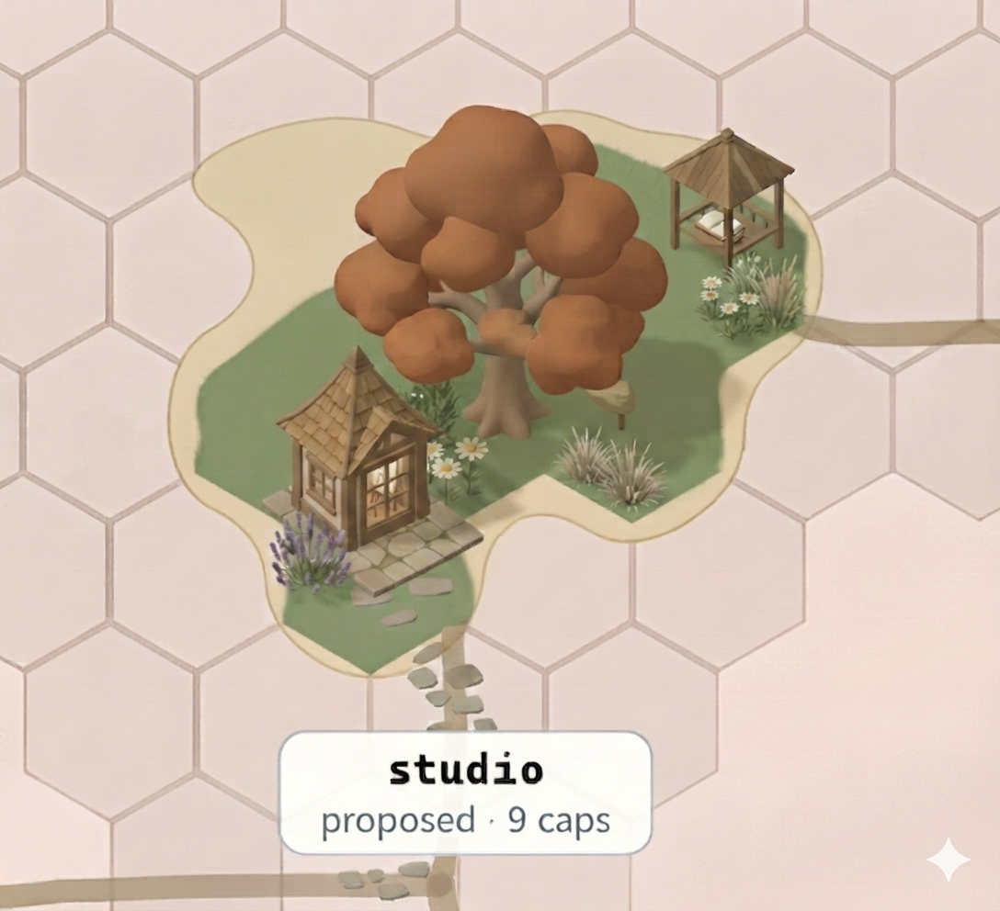

# Cosy-island concept — the aesthetic target for grounded-art-machinery-arc

**`cosy-island-concept.png`** — owner-generated with **nano banana** (Google Gemini image
generation), 2026-07-20. This is a **concept image**: it goes *to a model / informs the factory kit*,
it is **never parsed by our code or inlined** (ADR-0217 D2 — consuming free-form vector/raster is
exactly what produced the 19 defective buildings).

## What it captures — the direction the owner wants

A **cosy** island: warm, painterly, a **few well-placed hero objects** that read as a homestead/garden
— a shingled cottage (lavender bed, daisies, a stone path), one big autumn tree, a small gazebo, a
couple of grass tufts — on the soft green island against the pink hex ground. It reads as *a place
someone lives*, not a field of markers.

## Why this exists — the standing-stone verdict (increment 6, #832)

Increment 6 drove the UAT-marker standing-stones through the factory as baked isometric solids
([ADR-0218](../../decisions/0218-baked-art-carries-resolved-paint-into-the-shared-scene-via-a.md)),
behind `?factoryart=on`. The owner looked (2026-07-20) and gave a **negative verdict**:

> "the stones glue well to the island but they collide with the buildings, i also think stones is not
> the right move, the islands now feel messy and noisy rather than cosy."

So **one-marker-per-UAT-criterion as a standing object is out** — many stones scattered per island is
the *noise*. The island should feel **cosy**, like this concept, not busy. (The baked-stone machinery
itself is sound and default-off; the rejection is of the CONCEPT — stones as the marker — not the
pipeline.)

## What the next session is asked to explore (owner-directed, 2026-07-20)

1. **Integrate nano banana into the pipeline.** Google ships SDKs for Gemini image generation. The
   question is where a generative entry point fits ADR-0217's "concept art designs the FACTORY, not the
   instance" (D8) — a reference informs one object type's kit once, deliberately; instances are then
   composed from that kit, never inlined.
2. **Get rid of the stones — replace them with tall flowers for now.** A lightweight, cosy stand-in
   for the UAT-criteria markers while the bigger direction is worked out.
3. **Talk about this concept and how to procedurally generate something more like it.** The cosy,
   few-hero-objects look — closer to a garden than a marker field.

## Standing constraints the next session must hold

- **ADR-0217 D1** — one factory *per object type*, no factory that connects them; cross-object
  placement stays procedural rules + seeded jitter in `scene.ts`.
- **ADR-0214 D4 / ADR-0217 D7** — historically "improving the art is a hard non-goal / fidelity to the
  existing look is the metric." The owner is now directing a specific **aesthetic DIRECTION** (cosy
  target, drop the stones). That is design-time direction, not the model reinterpreting — but the next
  session should confirm the framing with the owner before treating "make it cosier" as licence.
- **Reference never enters our code** (ADR-0217 D2) — this image informs a kit, it is not consumed.
